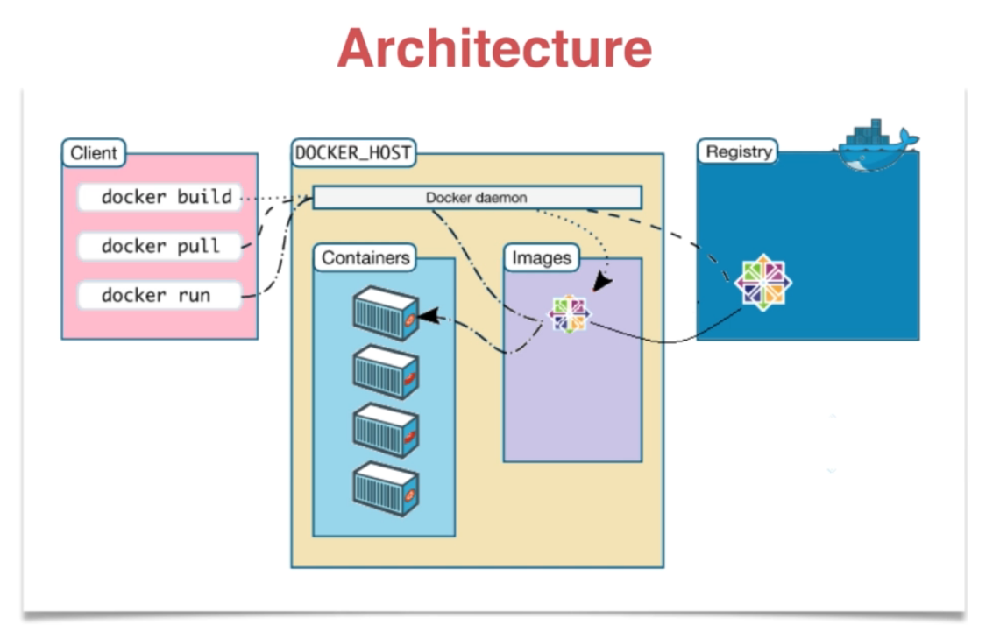
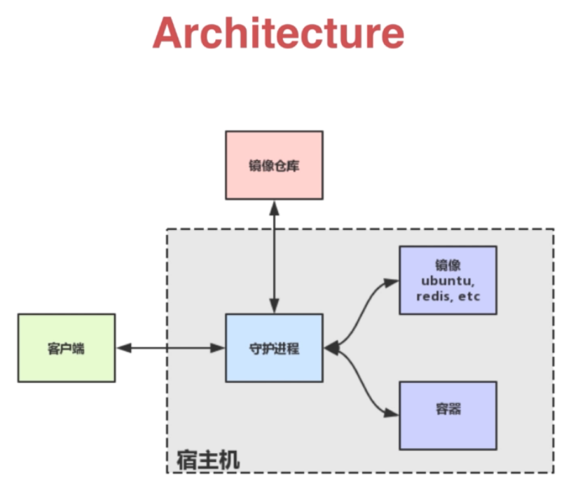

# Docker 架构介绍与实战

#### 解决如下问题：
docker的架构介绍和基本使用
- 如何制作镜像？
- 如何分享镜像？
- 如何持久化容器的数据？
- 如何编排一个多容器的应用？

## Mac下docker的安装
从www.docker.com下载适合系统的dmg文件拖拽安装即可。


## docker架构介绍



守护进程负责来与镜像，仓库和容器进行交流：



#### docker的一些常用方法：
```
1. 运行daocloud.io/nginx，由80端口映射在本地8080端口上：

docker run -p 8080:80 -d daocloud.io/nginx

-p 做端口映射，

-d 允许这个程序直接返回，把这个容器作为守护进程执行

2. copy文件到docker容器

docker cp 文件名 容器ID://usr/share/nginx/html

3. 保存对容器做的修改

docker commit -m '容器提交的msg' 容器ID 生成新镜像名字

4. 删除镜像

docker rmi 镜像ID

5. 列出容器

docker ps 列出当前运行的容器

docker ps -a 列出所有的容器

6. 删除容器

docker rm 容器ID1 容器ID2

7. 其他

docker pull 获取image

docker build 创建image

docker images 列出image

docker run 运行container

docker ps 列出container

docker rm 删除container

docker rmi 删除image

docker cp 在host和container之间拷贝文件

docker commit 保存改动为新的image
```

## 学习Dockerfile文件的编写

* 1.新建一个最简单的docker

```
FROM alpine:latest
MAINTAINER xbf
CMD echo 'hello docker'
```

在当前目录下新建并运行：
$docker build -t hello_docker .
$docker run hello_docker 


* 2.新建nginx的docker镜像
```
FROM ubuntu
MAINTAINER endlif
RUN sed -i 's/archive.ubuntu.com/mirrors.ustc.edu.cn/g' /etc/apt/sources.list 
RUN apt-get update
RUN apt-get install -y nginx
COPY index.html /var/www/html
ENTRYPOINT [ "/usr/sbin/nginx","-g","daemon off;"]
EXPOSE 80
```

在当前目录下新建并运行：
$docker build -t endlif/hello-nginx .
$docker run -d -p 80:80 endlif/hello-nginx 


测试：
curl http://localhost


* 3.镜像的分层

当image运行为一个容器时，会产生一个容器层(container layer)分的这一层是可读可写的。
分层好处：多个image时，相同的层可以共享，减轻压力。

## Volume: 提供了独立于容器之外的持久化存储

使用容器时遇到的问题：
运行容器时，在容器中的改动是不会被保存的，或者缺省是不会被保存的，那么volume提供了持久化保存的技巧。比如进行数据库的操作，运行数据库的容器，那么数据库的数据。

解决的办法
Volume 的基本操作  -v 参数指定 volume 的路径， 然后再用 inspect 查看 volume 映射到硬盘上的路径， 然后再直接更改硬盘上的文件。
容器和宿主机目录挂载的三种方式：

1.第一种方式：

```
# 运行容器内部地址nginx用来访问网页的地址/usr/share/nginx/html 
docker run -d --name nginx -v /usr/share/nginx/html nginx
#给出容器的所有信息
docker inspect nginx 
> Mounts.Source  宿主机目录 [如果是mac，则该路径不是mac上的实际路径，因为mac上运行docker是还有一层虚拟层,这是docker虚拟层中的路径，可以在docker中访问到]
> Mounts.Destination:/usr/share/nginx/html/ 容器目录
screen ~/Library/Containers/com.docker.docker/Data/com.docker.driver.amd64-linux/tty [这个路径才是mac本身挂载的目录]
```

2.第二种方式：
```
#将当前目录下的html子目录挂载到容器中中的/var/www/html
docker run -p 80:80 -d -v $PWD/html:/var/www/html nginx
```

3.第三种方式：
```
# 宿主机目录：$PWD/data docker目录：/var/mydata  容器名：data_container 基础镜像：ubuntu
docker create -v $PWD/data:/var/mydata --name data_container ubuntu
# -it表示使用交互的方式进入容器[默认ubuntu基础镜像没有服务]
docker run -it --volumes-from data_container ubuntu /bin/bash
#进入后执行mount,可以看到有/var/mydata目录的挂载信息
mount
```

## docker registry介绍

#### docker的术语：

host:宿主机 我们平时所用的电脑
image:镜像 
container:容器 我们编译而使用的叫容器
registry：仓库 用于存储镜像的地方
daemon：守护程序
client:客户端

#### 国内的一些仓库
https://www.daocloud.io/

https://www.tenxcloud.com 

https://cr.console.aliyun.com

## docker的registry实战
docker搜索，其结果按照STARS来排序

$docker search whalesay
$docker pull docker/whalesay
$docker run docker/whalesay cowsay boo


## docker compose实战
Dockerfile 可以让用户管理一个单独的应用容器；而 Compose 则允许用户在一个模板（YAML 格式）中定义一组相关联的应用容器（被称为一个 project，即项目），例如一个 Web 服务容器再加上后端的数据库服务容器等

```
docker-compose常用命令的含义:

build 本地创建镜像

command 覆盖缺省命令

depends_on 链接容器

ports 暴露端口

volumes 卷

up 启动服务

stop 停止服务

rm 删除服务中的各个容器

logs 观察各个容器的日志

ps 列出服务相关的容器
```

使用方式
docker-compose build // 创建容器
docker-compose up  // 启动项目，可查看输出信息
docker-compose up -d // 启动项目，后台执行
docker-compose stop // 停止容器
docker-compose rm // 删除所有容器
docker-compose logs // 观察容器的日志
docker-compose ps // 查看容器
网站首页： http://localhost:80/ 或 http://localhost:2368/

后台管理页： http://localhost:80/ghost

## 参考
代码是慕课网“Docker入门” 课程的 实战代码，通过检验。

课程地址：https://www.imooc.com/learn/867